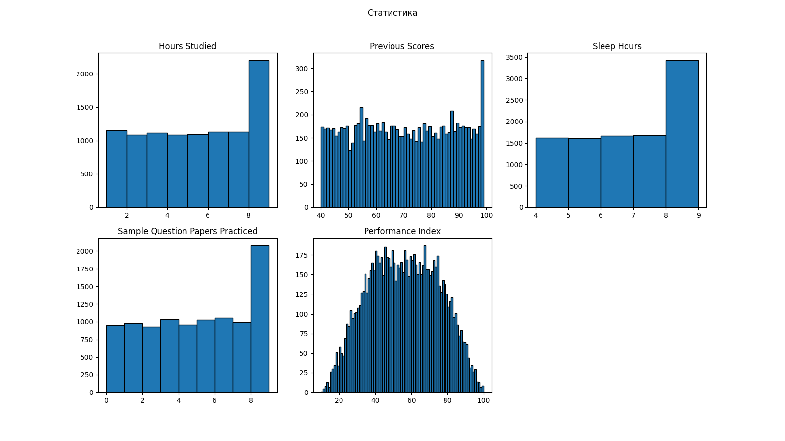
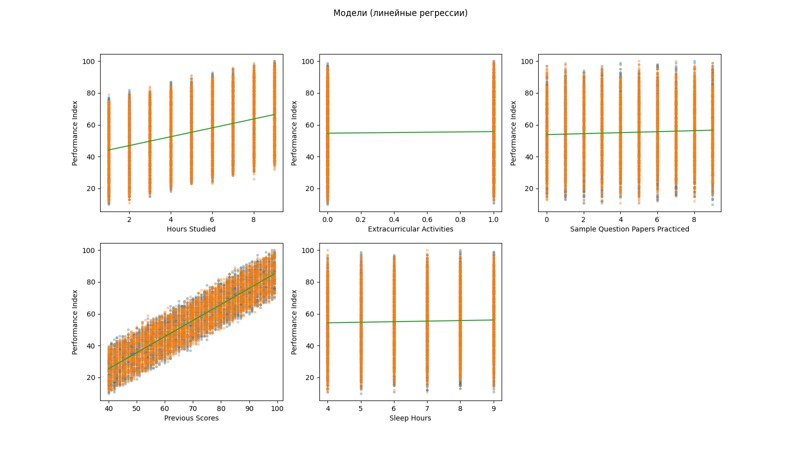
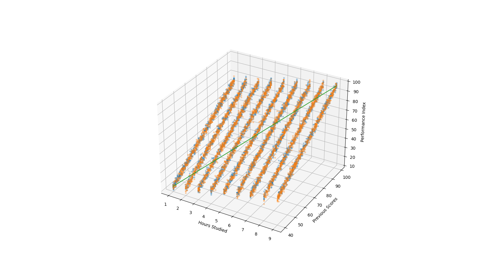

# Отчет по 3 лабораторной работе

По заданию, дан датасет информации об обучении студентов.

В датасете 10000 строк, в каждой из которых содержится следующая информация:

- Hours Studied (общее число часов, которое студент потратил на учебу)
- Previous Scores (результаты предыдущих тестов - от 0 до 100)
- Extracurricular Activities (участвовал ли студент во внеклассных мероприятиях \[Да/Нет\])
- Sleep Hours (среднее кол-во часов сна ежедневно)
- Sample Question Papers Practiced (кол-во решенных типовых вариантов заданий для подготовки)
- Performance Index (мера измерения успеваемости студента, варьируется от 10 до 100, и чем больше значение, тем лучше он учится)

Целевая метрика - Performance Index.

## Статистика по датасету

_Гистограммы распределения._

### Статистика (Hours Studied)

- Среднее значение: 4.9929
- Минимальное значение: 1
- Максимальное значение: 9
- Стандартное отклонение: 2.589179
- Квантили:
  - 25% процентиль: 3
  - 50% процентиль: 5
  - 75% процентиль: 7
  - 90% процентиль: 9

### Статистика (Previous Scores)

- Среднее значение: 69.4457
- Минимальное значение: 40
- Максимальное значение: 99
- Стандартное отклонение: 17.342285
- Квантили:
  - 25% процентиль: 54
  - 50% процентиль: 69
  - 75% процентиль: 85
  - 90% процентиль: 93

### Статистика (Sleep Hours)

- Среднее значение: 6.5306
- Минимальное значение: 4
- Максимальное значение: 9
- Стандартное отклонение: 1.695778
- Квантили:
  - 25% процентиль: 5
  - 50% процентиль: 7
  - 75% процентиль: 8
  - 90% процентиль: 9

### Статистика (Sample Question Papers Practiced)

- Среднее значение: 4.5833
- Минимальное значение: 0
- Максимальное значение: 9
- Стандартное отклонение: 2.867204
- Квантили:
  - 25% процентиль: 2
  - 50% процентиль: 5
  - 75% процентиль: 7
  - 90% процентиль: 9

### Статистика (Performance Index)

- Среднее значение: 55.2248
- Минимальное значение: 10.0
- Максимальное значение: 100.0
- Стандартное отклонение: 19.211597
- Квантили:
  - 25% процентиль: 40.0
  - 50% процентиль: 55.0
  - 75% процентиль: 71.0
  - 90% процентиль: 81.0

## Модели

Оценки моделей приведены ниже.

### Регрессия (Performance Index, Hours Studied)

- Уравнение (конкретное): $y = 41.340168 + 2.789979 x_1$
- Коэффициент детерминации ($R^2$): $0.138603$

### Регрессия (Performance Index, Previous Scores)

- Уравнение (конкретное): $y = -15.08612 + 1.012041 x_1$
- Коэффициент детерминации ($R^2$): $0.836495$

### Регрессия (Performance Index, Extracurricular Activities)

- Уравнение (конкретное): $y = 54.732143 + 1.001587 x_1$
- Коэффициент детерминации ($R^2$): $0.000521$

### Регрессия (Performance Index, Sleep Hours)

- Уравнение (конкретное): $y = 52.933217 + 0.351716 x_1$
- Коэффициент детерминации ($R^2$): $0.003113$

### Регрессия (Performance Index, Sample Question Papers Practiced)

- Уравнение (конкретное): $y = 53.812932 + 0.312062 x_1$
- Коэффициент детерминации ($R^2$): $0.001545$

### Регрессия (Performance Index, Hours Studied, Previous Scores)

- Уравнение (конкретное): $y = -29.593431 + 2.855503 x_1 + 1.016107 x_2$
- Коэффициент детерминации ($R^2$): $0.985702$

## Итог

Как видно, модель, основанная на совокупности признаков Hours Studied и Previous Scores (последняя), имеет наивысший коэффициент детерминации, а значит, Performance Index зависит от этой совокупности в высокой степени. Иначе говоря, результат показывает, что чем больше студент учится и чем лучше его предыдущие результаты, тем более высоким будет его показатель текущей успеваемости. Схожий вывод можно сделать просто посмотрев на график прямой-уравнения линейной регрессии: значение по координате Performance Index растет тогда, когда увеличиваются Hours Studied и Previous Scores.

Исходя из анализа, меньше всего Performance Index зависит от участия во внеучебных активностях и кол-ве решенных тестовых вариантов заданий. Это видно и из графиков - линия регрессии почти горизонтальна и значение Performance Index почти не увеличивается с ростом значений Extracurricular Activities и Sample Question Papers Practiced.
