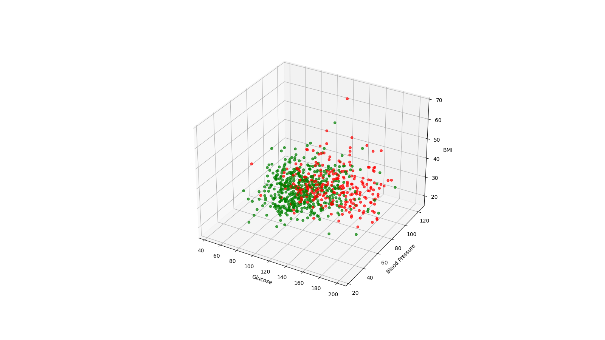
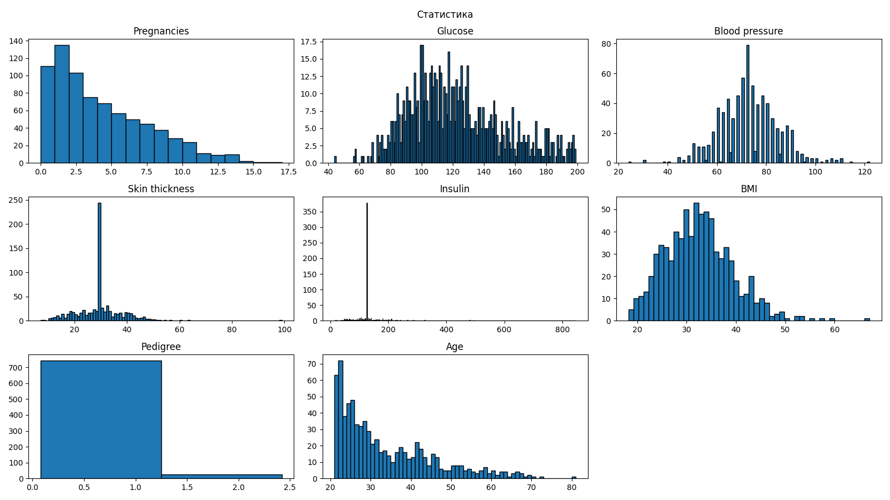
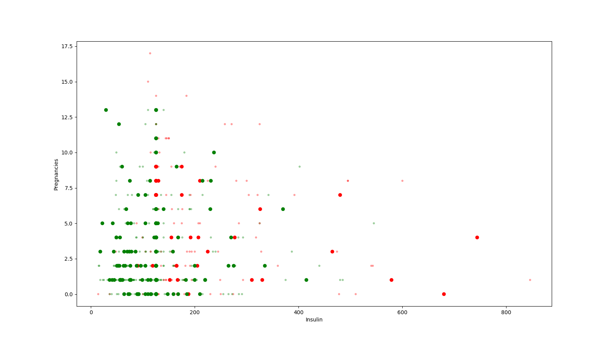
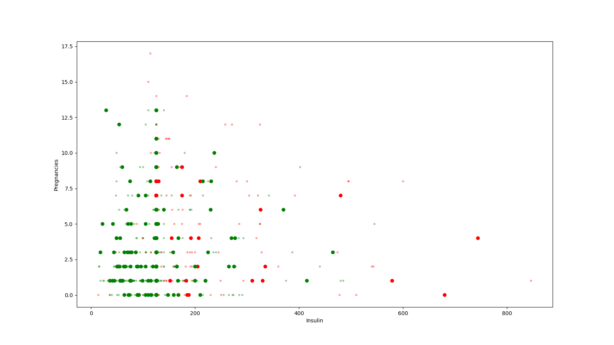
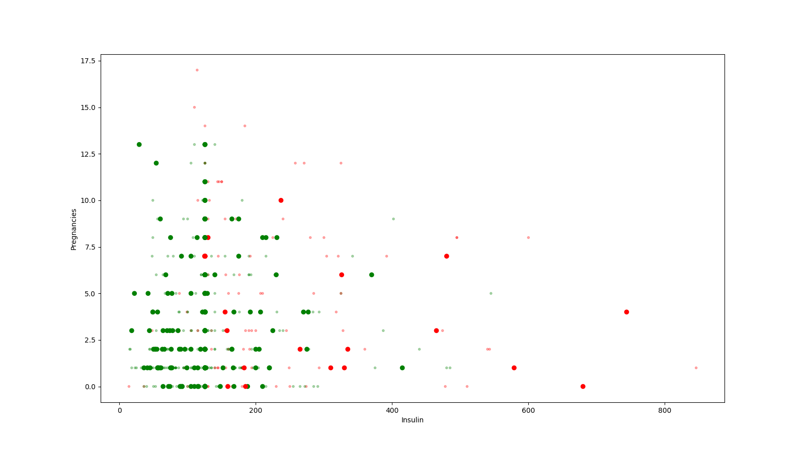
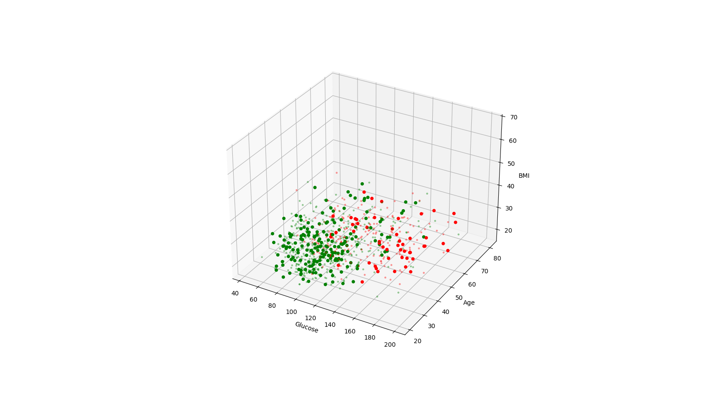

# Отчет по 4 лабораторной работе

Выборка: 768 строк

По заданию, дан датасет информации о диабете: информация о людях (pregnancies, insulin, ...) и результат (outcome): есть ли у них диабет (1) или нет (0).

Подробная информация:

- Pregnancies (кол-во беременностей)
- Glucose (уровень глюкозы)
- Blood Pressure (кровяное давление)
- Skin Thickness (толщина кожи)
- Insulin (уровень инсулина)
- BMI (индекс массы тела)
- Pedigree (некий показатель наследственности)
- Age (возраст)

В датасете присутствуют аномалии (0 уровень глюкозы, толщина кожи 0 и т.п.) - эти данные были обработаны - вместо некорректных значений были установлены медианы конкретных признаков. Медиана является неплохим "усреднителем" - установка характеристики в медианное значение не сильно влияет на результаты исследования, так как фактически это отражение "типичного" значения конкретной характеристики. Конкретно в kNN с помощью медианы мы добиваемся того, что значения окажутся аномально далеко от всех остальных. Медиана порой считается более удачным способом избавления от аномалий, чем среднее значение - так как среднее значение поддается влиянию наличия крайне высоких/низких значений, тогда как медиана этому не подвержена.

## Визуализация выбранных признаков (3)

## Статистика по датасету

_Статистика по датасету (аномалии убраны)_.

### Статистика (Pregnancies)
- Среднее значение: 3.8450520833333335
- Минимальное значение: 0
- Максимальное значение: 17
- Стандартное отклонение: 3.367384
- Квантили:
  - 25% процентиль: 1
  - 50% процентиль: 3
  - 75% процентиль: 6
  - 90% процентиль: 9

### Статистика (Glucose)
- Среднее значение: 121.65625
- Минимальное значение: 44
- Максимальное значение: 199
- Стандартное отклонение: 30.418463
- Квантили:
  - 25% процентиль: 100
  - 50% процентиль: 117
  - 75% процентиль: 141
  - 90% процентиль: 167

### Статистика (Blood pressure)
- Среднее значение: 72.38671875
- Минимальное значение: 24
- Максимальное значение: 122
- Стандартное отклонение: 12.088764
- Квантили:
  - 25% процентиль: 64
  - 50% процентиль: 72
  - 75% процентиль: 80
  - 90% процентиль: 88

### Статистика (Skin thickness)
- Среднее значение: 29.108072916666668
- Минимальное значение: 7
- Максимальное значение: 99
- Стандартное отклонение: 8.785496
- Квантили:
  - 25% процентиль: 25
  - 50% процентиль: 29
  - 75% процентиль: 32
  - 90% процентиль: 40

### Статистика (Insulin)
- Среднее значение: 140.91536458333334
- Минимальное значение: 14
- Максимальное значение: 846
- Стандартное отклонение: 86.28295
- Квантили:
  - 25% процентиль: 122
  - 50% процентиль: 125.5
  - 75% процентиль: 128
  - 90% процентиль: 210

### Статистика (BMI)
- Среднее значение: 32.455208333333296
- Минимальное значение: 18.2
- Максимальное значение: 67.1
- Стандартное отклонение: 6.870699
- Квантили:
  - 25% процентиль: 27.5
  - 50% процентиль: 32.3
  - 75% процентиль: 36.6
  - 90% процентиль: 41.5

### Статистика (Pedigree)
- Среднее значение: 0.47187630208333314
- Минимальное значение: 0.078
- Максимальное значение: 2.42
- Стандартное отклонение: 0.331113
- Квантили:
  - 25% процентиль: 0.244
  - 50% процентиль: 0.374
  - 75% процентиль: 0.627
  - 90% процентиль: 0.88

### Статистика (Age)
- Среднее значение: 33.240885416666664
- Минимальное значение: 21
- Максимальное значение: 81
- Стандартное отклонение: 11.752573
- Квантили:
  - 25% процентиль: 24
  - 50% процентиль: 29
  - 75% процентиль: 41
  - 90% процентиль: 51

## Модели

Возьмем 2 модели: фиксированную (Glucose, Blood Pressure, BMI) и случайную (получилась Insulin, Pregnancies).

Для каждой применим kNN с k=3, k=5, k=10.

После, построим матрицу ошибок и с ее помощью найдем Accuracy и F1 Score - метрики. Как и другие метрики, они основываются на Precision (точность) и Recall (полнота).

$$
precision = \frac{TP}{TP + FP}
$$

$$
recall = \frac{TP}{TP + FN}
$$

$$
accuracy = \frac{TN + TP}{TN + FP + FN + TP}
$$

$$
F_1 = \frac{2 precision * recall}{precision + recall}
$$

### Модель [Glucose, Blood Pressure, BMI] (k=3)

Матрица ошибок:

| Truth \ Predicted | Negative | Positive |
|-------------------|----------|----------|
| Negative  |   110 |    40 |
| Positive  |    40 |    39 |

Точность (Accuracy): 0.650655

F1-мера (F1 score): 0.493671

### Модель [Glucose, Blood Pressure, BMI] (k=5)

Матрица ошибок:

| Truth \ Predicted | Negative | Positive |
|-------------------|----------|----------|
| Negative  |   118 |    32 |
| Positive  |    39 |    40 |

Точность (Accuracy): 0.689956

F1-мера (F1 score): 0.529801

### Модель [Glucose, Blood Pressure, BMI] (k=10)

Матрица ошибок:

| Truth \ Predicted | Negative | Positive |
|-------------------|----------|----------|
| Negative  |   133 |    17 |
| Positive  |    47 |    32 |

Точность (Accuracy): 0.720524

F1-мера (F1 score): 0.5

### Модель [Insulin, Pregnancies] (k=3)

Матрица ошибок:

| Truth \ Predicted | Negative | Positive |
|-------------------|----------|----------|
| Negative  |   128 |    22 |
| Positive  |    55 |    24 |

Точность (Accuracy): 0.663755

F1-мера (F1 score): 0.384

### Модель [Insulin, Pregnancies] (k=5)

Матрица ошибок:

| Truth \ Predicted | Negative | Positive |
|-------------------|----------|----------|
| Negative  |   129 |    21 |
| Positive  |    66 |    13 |

Точность (Accuracy): 0.620087

F1-мера (F1 score): 0.230088

### Модель [Insulin, Pregnancies] (k=10)

Матрица ошибок:

| Truth \ Predicted | Negative | Positive |
|-------------------|----------|----------|
| Negative  |   136 |    14 |
| Positive  |    68 |    11 |

Точность (Accuracy): 0.641921

F1-мера (F1 score): 0.211538

## Итоги

Рассматривая получившиеся модели с различными k, по показателю F1, наиболее удачной оказалась модель `[Glucose, Blood Pressure, BMI] (k=5)` с показателем `0.529801`.

По `accuracy` же вперед вышла `[Glucose, Blood Pressure, BMI] (k=10)` с показателем `0.720524`.

## Бонус

С помощью перебора ([find_best.py](find_best.py)), найдена лучшая модель: `[Glucose, BMI, Age] (k=10)` с $F_1 = 0.642336$ (от запуска к запуску варьируется из-за случайности разделения данных на тестовые/обучающие, но суть та же).

### Модель [Glucose, Age, BMI] (k=10)

Матрица ошибок:

| Truth \ Predicted | Negative | Positive |
|-------------------|----------|----------|
| Negative  |   146 |     9 |
| Positive  |    40 |    44 |

Точность (Accuracy): 0.794979

F1-мера (F1 score): 0.642336
