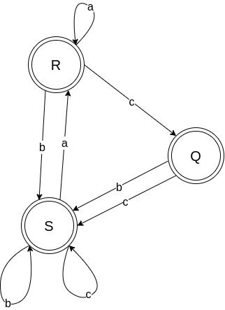

# ДЗ 1

Для каждой грамматики из списка, соответствующему варианту, определить тип грамматики по классификации Хомского, для грамматик типа 2 и 3 необходимо привести вывод не менее двух предложений языка, принадлежащих языку, порождаемому грамматикой.

Укажите язык, порождаемый грамматикой, в множественно-теоретическом виде.

Вариант: `17`

Задачи: `9`, `26`, `33`

## Задача 9

```text
S → A | B
A → aAb | ab
B → aaaBb | aBbbb | aaab | abbb
```

Для начала положим, что это грамматика 3 типа.

Третье правило нарушает 3 тип - в нем есть нарушающий aaaBb.

2 тип соблюдается. Это грамматика 2 типа (контекстно-свободный язык).

Этот язык генерирует последовательность из `a`, `b`, при том так, что сначала идет ненулевое кол-во `a`, затем - ненулевое кол-во `b`.

Примеры предложений:

1. `S -> A -> ab`
2. `S -> A -> aAb -> aaAbb -> aaaabbbb`
3. `S -> B -> aaab`
4. `S -> B -> abbb`
5. `S -> B -> aaaBb -> aaaaBbbbb -> aaaaaaabbbbb`

## Задача 26

```text
S → SS | RS
R → RR | 0
RS → SR
0S0 → 010
```

Для начала положим, что это грамматика 3 типа. Однако, четвертое правило нарушает правила 3, 2. Это грамматика 1 типа (контекстно-зависимый язык).

Этот язык генерирует предложения, состоящие из 0 и 1.

Примеры предложений:

1. `S -> RS -> 0S -> 0RS -> 0RRS -> 0R0RS -> 000SR -> 000S0 -> 00010`
2. `S -> RS -> RRS -> RSR -> 0SR -> 0S0 -> 010`

## Задача 33

Для алфавита `А = {a, b, c}` необходимо сконструировать регулярную грамматику и детерминированный конечный автомат для языка из символов этого алфавита: Множество строк, которые не содержат подстроку `aсa`.

Допускается построение ДКА по регулярной грамматике, и регулярной грамматике по ДКА. Для полученного ДКА необходимо написать функцию / программу, моделирующую поведение этого автомата. В качестве тестов нужно представить не менее четырех корректных входных цепочек и цепочек, не допускаемых данным автоматом.

Для начала построим грамматику и приведем ее к регулярной.

Сперва для удобства построим грамматику просто для получения всех последовательностей из `a`, `b`, `c`:

```text
S -> aS | bS | cS | a | b | c | ε
```

Далее, ограничим `aca` с помощью доп.правил. В правило `R` можно попасть только из `aR` (в `S`). В правило `Q` можно попасть только из `cQ` (в `R`). Из `Q` можно "выбраться" только через `b`, `c` - тем самым мы запретили цепочки вида `aca`, "обрывая" их на `ac`:

```text
S -> aR | bS | cS | a | b | c | ε
R -> cQ | aR | bS | a | b | c
Q -> bS | cS | b | c
```

Уберем одиночные `a`, `b`, `c` для избежания повторений:

```text
S -> aR | bS | cS | ε
R -> cQ | aR | bS | ε
Q -> bS | cS | ε
```

Полученная грамматика соответствует 3 типу. Это регулярный язык.

Построим детерминированный конечный автомат на основе языка:



Как видно, здесь сразу все 3 состояния являются терминальными. Цепочка из R, Q отвечает за недопущение последовательности `aca`.

Исходный код программы, реализующей проверку на основе представленного выше автомата доступен в [dfa.c](dfa.c).
