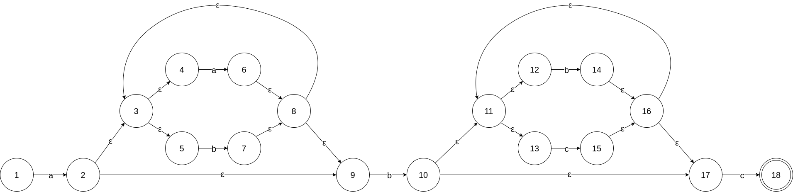

<!--
this bad boy is here so that VSCode extension exports this file to PDF properly
see https://github.com/yzane/vscode-markdown-pdf/issues/355

(adds latex support)
-->
<script type="text/javascript" src="http://cdn.mathjax.org/mathjax/latest/MathJax.js?config=TeX-AMS-MML_HTMLorMML"></script>
<script type="text/x-mathjax-config">
  MathJax.Hub.Config({ tex2jax: {inlineMath: [['$', '$']]}, messageStyle: "none" });
</script>

# ДЗ 2

Студент: `Султанов Артур Радикович` (`367553`), группа `P3313`

Вариант: `17`

Регулярное выражение: `a(a|b)*b(b|c)*c`

## Выполнение

### Недетерминированный конечный автомат

Построим недетерминированный конечный автомат:



По частям:

- `a`: Символ `a`. Совокупность 1 и 2 состояний
- `(a|b)*`: Последовательность (возможно, нулевой длины) символов `a`, `b`. Совокупность состояний 2 - 9.
- `b`: Символ `b`. Совокупность 9 и 10 состояний
- `(b|c)*`: Последовательность (возможно, нулевой длины) символов `b`, `c`. Совокупность состояний 10 - 17.
- `c`: Символ `c`. Совокупность 17 и 18 состояний.

По общему виду видно, что здесь подразумеваются строки, начинающиеся с a, имеющие в середине b и заканчивающиеся на c, при том между указанными a и b может быть любое кол-во a/b, между указанными b и c может быть любое кол-во b/c.

### Детерминированный конечный автомат

Далее, построим ДКА по полученному на предыдущем этапе НКА.

Начальное состояние - `1`, начнем с него. По пути будем заполнять таблицу.

- Шаг 1

    `ε-closure(1) = {1}` (State 1)

- Шаг 2

    `Move({1}, a) = {2}`

    `ε-closure({2}) = {2, 3, 4, 5, 9}` (State 2)

    `Move({1}, b)` перехода нет

    `Move({1}, c)` перехода нет

- Шаг 3:

    `Move({2, 3, 4, 5, 9}, a) = {6}`

    `ε-closure({6}) = {3, 4, 5, 6, 8, 9}` (State 3)

    `Move({2, 3, 4, 5, 9}, b) = {7, 10}`

    `ε-closure({7, 10}) = {3, 4, 5, 7, 8, 9, 10, 11, 12, 13, 17}` (State 4)

    `Move({2, 3, 4, 5, 9}, c)` перехода нет

- Шаг 4:

    `Move({3, 4, 5, 6, 8, 9}, a) = {6}`

    `ε-closure({6}) = {3, 4, 5, 6, 8, 9}` (такое состояние уже есть)

    `Move{3, 4, 5, 6, 8, 9}, b) = {7, 10}`

    `ε-closure({7, 10}) = {3, 4, 5, 7, 8, 9, 10, 11, 12, 13, 17}` (такое состояние уже есть)

    `Move({3, 4, 5, 6, 8, 9}, c)` перехода нет

- Шаг 5:

    `Move({3, 4, 5, 7, 8, 9, 10, 11, 12, 13, 17}, a) = {6}`

    `ε-closure({6}) = {3, 4, 5, 6, 8, 9}` (такое состояние уже есть)

    `Move({3, 4, 5, 7, 8, 9, 10, 11, 12, 13, 17}, b) = {7, 10, 14}`

    `ε-closure({7, 10, 14}) = {3, 4, 5, 7, 8, 9, 10, 11, 12, 13, 14, 16, 17}` (State 5)

    `Move({3, 4, 5, 7, 8, 9, 10, 11, 12, 13, 17}, c) = {15, 18}`

    `ε-closure({15, 18}) = {11, 12, 13, 15, 16, 17, 18}` (State 6)

- Шаг 6:

    `Move({3, 4, 5, 7, 8, 9, 10, 11, 12, 13, 14, 16, 17}, a) = {6}`

    `ε-closure({6}) = {3, 4, 5, 6, 8, 9}` (такое состояние уже есть)

    `Move({3, 4, 5, 7, 8, 9, 10, 11, 12, 13, 14, 16, 17}, b) = {7, 10, 14}`

    `ε-closure({7, 10, 14}) = {3, 4, 5, 7, 8, 9, 10, 11, 12, 13, 14, 16, 17}` (такое состояние уже есть)

    `Move({3, 4, 5, 7, 8, 9, 10, 11, 12, 13, 14, 16, 17}, c) = {15, 18}`

    `ε-closure({15, 18}) = {11, 12, 13, 15, 16, 17, 18}` (такое состояние уже есть)

- Шаг 7:

    `Move({11, 12, 13, 15, 16, 17, 18}, a)` перехода нет

    `Move({11, 12, 13, 15, 16, 17, 18}, b) = {14}`

    `ε-closure({14}) = {11, 12, 13, 14, 16, 17}` (State 7)

    `Move({11, 12, 13, 15, 16, 17, 18}, c) = {15, 18}`

    `ε-closure({15, 18}) = {11, 12, 13, 15, 16, 17, 18}` (такое состояние уже есть)

- Шаг 8:

    `Move({11, 12, 13, 14, 16, 17}, a)` перехода нет

    `Move({11, 12, 13, 14, 16, 17}, b) = {14}`

    `ε-closure({14}) = {11, 12, 13, 14, 16, 17}` (такое состояние уже есть)

    `Move({11, 12, 13, 14, 16, 17}, c) = {15, 18}`

    `ε-closure({15, 18}) = {11, 12, 13, 15, 16, 17, 18}` (такое состояние уже есть)

Таблица:

| Состояние | $a$ | $b$ | $c$ |
|-----------|-----|-----|-----|
| `{1}` | `{2, 3, 4, 5, 9}` | -  | - |
| `{2, 3, 4, 5, 9}` | `{3, 4, 5, 6, 8, 9}` | `{3, 4, 5, 7, 8, 9, 10, 11, 12, 13, 17}` | - |
| `{3, 4, 5, 6, 8, 9}` | `{3, 4, 5, 6, 8, 9}` | `{3, 4, 5, 7, 8, 9, 10, 11, 12, 13, 17}` | - |
| `{3, 4, 5, 7, 8, 9, 10, 11, 12, 13, 17}` | `{3, 4, 5, 6, 8, 9}` | `{3, 4, 5, 7, 8, 9, 10, 11, 12, 13, 14, 16, 17}` | `{11, 12, 13, 15, 16, 17, 18}` |
| `{3, 4, 5, 7, 8, 9, 10, 11, 12, 13, 14, 16, 17}` | `{3, 4, 5, 6, 8, 9}` | `{3, 4, 5, 7, 8, 9, 10, 11, 12, 13, 14, 16, 17}` | `{11, 12, 13, 15, 16, 17, 18}` |
| `(o) {11, 12, 13, 15, 16, 17, 18}` | - | `{11, 12, 13, 14, 16, 17}` | `{11, 12, 13, 15, 16, 17, 18}` |
| `{11, 12, 13, 14, 16, 17}` | - | `{11, 12, 13, 14, 16, 17}` | `{11, 12, 13, 15, 16, 17, 18}` |


## Минимизация ДКА

Сначала выпишем таблицу, поставив вместо множеств номера состояний.

Далее, разобьем на классы эквивалентности $A_0$ - допускающие, $B_0$ - не допускающие. Получаем $P_0 = \{ A_0 = <6>, B_0 = <1, 2, 3, 4, 5, 7> \}$

На 1 шаге разобьем по принципу, что состояния попадают в один класс, если их невозможно отличить при подаче на вход цепочек из 1 символа (иначе говоря, что их "строчки" полностью совпадают). Получаем ($B_0$ разбивается на несколько классов): $P_1 = \{ A_1 = <6>, B_1 = <1>, C_1 = <2, 3>, D_1 = <4, 5>, E_1 = <7> \}$

На 2 шаге получаем: $P_2 = \{ A_2 = <6>, B_2 = <1>, C_2 = <2, 3>, D_2 = <4, 5>, E_2 = <7> \}$. Классы не поменялись ($P_2 = P_1$), минимизация завершена.

| $\delta$ | $a$ | $b$ | $c$ | $a_0$ | $b_0$ | $c_0$ | $a_1$ | $b_1$ | $c_1$ | $a_2$ | $b_2$ | $c_2$ |
|----------|-----|-----|-----|-------|-------|-------|-------|-------|-------|-------|-------|-------|
| 1     | 2 | - | - | $B_0$ | -     | -     | $C_1$ | -     | -     | $C_2$ | -     | -     |
| 2     | 3 | 4 | - | $B_0$ | $B_0$ | -     | $C_1$ | $D_1$ | -     | $C_2$ | $D_2$ | -     |
| 3     | 3 | 4 | - | $B_0$ | $B_0$ | -     | $C_1$ | $D_1$ | -     | $C_2$ | $D_2$ | -     |
| 4     | 3 | 5 | 6 | $B_0$ | $B_0$ | $A_0$ | $C_1$ | $D_1$ | $A_1$ | $C_2$ | $D_2$ | $A_2$ |
| 5     | 3 | 5 | 6 | $B_0$ | $B_0$ | $A_0$ | $C_1$ | $D_1$ | $A_1$ | $C_2$ | $D_2$ | $A_2$ |
| **6** | - | 7 | 6 | -     | $B_0$ | $A_0$ | -     | $E_1$ | $A_1$ | -     | $E_2$ | $A_2$ |
| 7     | - | 7 | 6 | -     | $B_0$ | $A_0$ | -     | $E_1$ | $A_1$ | -     | $E_2$ | $A_2$ |

Обозначим:

| Класс       | Номер состояния в новом ДКА |
|-------------|-----------------------------|
| `(o)` $A_2$ | 5                           |
| $B_2$       | 1                           |
| $C_2$       | 2                           |
| $D_2$       | 3                           |
| $E_2$       | 4                           |

Получаем таблицу переходов:

| $\delta$ | $a$ | $b$ | $c$ |
|----------|-----|-----|-----|
| 1        | 2   | -   | -   |
| 2        | 2   | 3   | -   |
| 3        | 2   | 3   | 5   |
| 4        | -   | 4   | 5   |
| `(o)`  5 | -   | 4   | 5   |


## Программа-распознаватель

```c
#include <stdio.h>
#include <stdbool.h>

enum State {
    STATE_1,
    STATE_2,
    STATE_3,
    STATE_4,
    STATE_5,
};

bool is_state_accepting(enum State state) {
    return state == STATE_5;
}

bool check_string(const char *s) {
    enum State state = STATE_1;

    size_t cursor = 0;

    while (s[cursor] != '\0') {
        char sym = s[cursor];

        switch (state) {
            case STATE_1: {
                switch (sym) {
                    case 'a': {
                        cursor++;
                        state = STATE_2;
                        break;
                    }
                    case 'b':
                    case 'c': {
                        return false;
                    }
                    default: {
                        return false;
                    }
                }
                break;
            }
            case STATE_2: {
                switch (sym) {
                    case 'a': {
                        cursor++;
                        state = STATE_2;
                        break;
                    }
                    case 'b':{
                        cursor++;
                        state = STATE_3;
                        break;
                    }
                    case 'c': {
                        return false;
                    }
                    default: {
                        return false;
                    }
                }
                break;
            }
            case STATE_3: {
                switch (sym) {
                    case 'a': {
                        cursor++;
                        state = STATE_2;
                        break;
                    }
                    case 'b':{
                        cursor++;
                        state = STATE_3;
                        break;
                    }
                    case 'c': {
                        cursor++;
                        state = STATE_5;
                        break;
                    }
                    default: {
                        return false;
                    }
                }
                break;
            }
            case STATE_4: {
                switch (sym) {
                    case 'a': {
                        return false;
                    }
                    case 'b':{
                        cursor++;
                        state = STATE_4;
                        break;
                    }
                    case 'c': {
                        cursor++;
                        state = STATE_5;
                        break;
                    }
                    default: {
                        return false;
                    }
                }
                break;
            }
            case STATE_5: {
                switch (sym) {
                    case 'a': {
                        return false;
                    }
                    case 'b':{
                        cursor++;
                        state = STATE_4;
                        break;
                    }
                    case 'c': {
                        cursor++;
                        state = STATE_5;
                        break;
                    }
                    default: {
                        return false;
                    }
                }
                break;
            }
        }
    }

    return is_state_accepting(state);
}

struct Sample {
    const char *s;
    bool expected;
};

struct Sample samples[] = {
    (struct Sample) { .s = "", .expected = false },
    (struct Sample) { .s = "a", .expected = false },
    (struct Sample) { .s = "b", .expected = false },
    (struct Sample) { .s = "c", .expected = false },
    (struct Sample) { .s = "ab", .expected = false },
    (struct Sample) { .s = "bc", .expected = false },
    (struct Sample) { .s = "ac", .expected = false },
    (struct Sample) { .s = "acbc", .expected = false },
    (struct Sample) { .s = "abcb", .expected = false },
    (struct Sample) { .s = "babc", .expected = false },

    (struct Sample) { .s = "abc", .expected = true },
    (struct Sample) { .s = "aabc", .expected = true },
    (struct Sample) { .s = "abbc", .expected = true },
    (struct Sample) { .s = "abcc", .expected = true },
    (struct Sample) { .s = "aabbcc", .expected = true },
    (struct Sample) { .s = "abababcbcbc", .expected = true },
    (struct Sample) { .s = "aaaaabbbbbccccc", .expected = true },
    (struct Sample) { .s = "abababcbcbcbcbc", .expected = true },
    (struct Sample) { .s = "aaabbbaaabbbcccbbbccc", .expected = true },
};

const char *fmt_bool(bool b) {
    return b ? "true" : "false";
}

int main() {
    for (size_t i = 0; i < sizeof(samples) / sizeof(samples[0]); i++) {
        bool actual = check_string(samples[i].s);

        if (actual == samples[i].expected) {
            printf("[OK]  '%s': %s\n", samples[i].s, fmt_bool(actual));
        } else {
            printf("[ERR] '%s': %s, expected: %s\n", samples[i].s, fmt_bool(actual), fmt_bool(samples[i].expected));
        }
    }

    return 0;
}
```

Пример запуска:

```bash
❯ ./dfa-minimized.elf
[OK]  '': false
[OK]  'a': false
[OK]  'b': false
[OK]  'c': false
[OK]  'ab': false
[OK]  'bc': false
[OK]  'ac': false
[OK]  'acbc': false
[OK]  'abcb': false
[OK]  'babc': false
[OK]  'abc': true
[OK]  'aabc': true
[OK]  'abbc': true
[OK]  'abcc': true
[OK]  'aabbcc': true
[OK]  'abababcbcbc': true
[OK]  'aaaaabbbbbccccc': true
[OK]  'abababcbcbcbcbc': true
[OK]  'aaabbbaaabbbcccbbbccc': true
```
