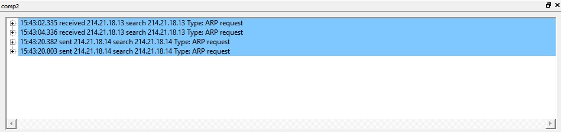
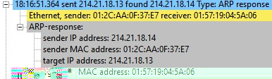
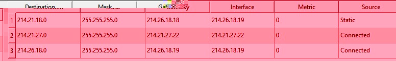

# Лабораторная работа №1

Студент: `Султанов Артур Радикович`, группа: `P3313`

`Ф=8`

`И=5`

`О=9`

`Н=13`

Исходный IP-адрес: `214.21.18.13`

Начальный адрес пула второй сети: `214.26.18.18`

Начальный адрес пула третьей сети: `214.21.27.22`

## Этап 1. Знакомство с NetEmul на примере простейшей сети из двух компьютеров

### 1. Построение сети

Создадим два компьютера `comp1`, `comp2`.

На данный момент таблицы у обоих компьютеров пустые.

### 2. Настройка компьютеров и сети

Первому компьютеру на сетевую карту (интерфейс eth0) назначим `214.21.18.13`, второму (интерфейс eth0) - `214.21.18.14`.

После назначения IP-адреса передается ARP-request, если быть точнее, Gratuitous ARP ([superuser](assets/img/https://superuser.com/a/376817), [wikipedia](assets/img/https://ru.wikipedia.org/wiki/ARP#%D0%94%D0%BE%D0%B1%D1%80%D0%BE%D0%B2%D0%BE%D0%BB%D1%8C%D0%BD%D1%8B%D0%B9_%D0%B7%D0%B0%D0%BF%D1%80%D0%BE%D1%81_ARP_(Gratuitous_ARP)), [wireshark wiki](assets/img/https://wiki.wireshark.org/Gratuitous_ARP)) - в них target IP и source IP совпадают. Запрос этот существует для оповещения других устройств о появлении нового и для проверки коллизий IP-адресов.

### 3. Анализ таблиц

В таблицах маршрутизации содержится информация о соответствии адресов назначения и интерфейсов, через которые нужно отправить пакет данных.

- Destination: целевой адрес
- Mask: маска сети назначения
- Gateway: шлюз, обозначется IP-адресом маршрутизатора (устройства) в сети, на который нужно отправить пакет, чтобы он дошел до целевого адреса
- Interface: интерфейс, через который доступен шлюз (может совпасть с gateway)
- Metric: числовой показатель, обозначающий предпочтительность маршрута. Чем меньше число, тем более предпочтителен маршрут. Можно воспринимать как "расстояние".
- Source: источник этой записи.

В данном случае у каждого компьютера есть информация о сети `214.21.18.0` - общей сети, в которой находятся эти два компьютера, как видно metric равен 0 - для того, чтобы добраться до этой сети, пакету необходимо лишь пройти eth0.

---

В ARP-таблицах хранятся связи IP-адрес - MAC-адрес компьютера.

Принцип работы:

- Компьютер, которому нужно выполнить отображение адреса IP на MAC-адрес, формирует ARP-запрос с адресом IP получателя и рассылает его широковещательно (broadcast).
- Все узлы сегмента локальной сети получают запрос ARP и сравнивают указанный адрес IP с собственным.
- В случае совпадения собственного адреса IP с полученным в запросе ARP, компьютер формирует ответ ARP, в котором указывает и свой IP-адрес, и свой MAC-адрес, и отправляет его уже адресно на ,MAC-адрес отправителя ARP-запроса.

Фактически, это таблица L3-L2, где нам известна L3-информация (IP), и мы хотим, чтобы L2 узнал свою информацию (MAC).

Здесь таблицы пустые, так как компьютеры еще не хотели "пообщаться".

### 4. Тестирование сети (отправка пакетов)

Для тестирования сети было отправлено сообщение размером 4KB с comp1 на comp2:

Последовательность событий:
- comp1 отправляет ARP-запрос на "поиск" MAC-адреса с указанным (равным comp2) IP-адресом:

    

- comp2 получает запрос
- comp2 заносит в ARP-таблицу информацию о comp1 (т.к. в ARP-запросе есть вся нужная информация об источнике)
- comp2 сравнивает target IP со своим и понимает, что это он
- comp2 отправляет ARP-ответ:

    

- comp1 получает этот ответ
- comp1 заносит в ARP-таблицу информацию о comp2

В результате у обоих компьютеров в их ARP-таблицах появилась инфомрация о друг друге:

Далее, comp1 отправляет UDP-пакеты на comp2:

## Этап 2. Линейная сеть из трех компьютеров

### 5. Построение сети с тремя компьютерами и анализ таблиц

Добавим еще один компьютер (comp3), подключим его к comp2, добавив для него дополнительный интерфейс/сетевую карту (eth1). Получаем следующую картину:

Из изменений - в таблице маршрутизации comp2 появилась новая запись (после подключения eth1 к сети):

Теперь comp2 имеет информацию о двух подсетях, тогда как компьютеры по краям - только об одной.

### 6. Тестирование сети (отправка пакетов)

Перед тем, как проверять сеть, добавим в таблицу маршрутизации `comp1` информацию о том, как попасть в подсеть `214.26.18.0`.

И сделаем то же самое для `comp3` (для подсети `214.21.18.0`).

Получаем:

И также у `comp2` включим маршрутизацию:

И теперь отправим сообщение по UDP от `comp1` к `comp3`:

`comp1` (`eth0`):

`comp2` (`eth0`):

`comp2` (`eth1`):

`comp3` (`eth0`):

Из интересного - `comp2`, прежде чем переслать UDP-сообщение на `comp3`, сначала сделал ARP-запрос, получил ARP-ответ и уже после отправил туда сообщение (т.к. это первый и до отправки запроса в ARP-таблице `comp2` не было записи об IP `comp3`)

## Этап 3. Полносвязная сеть из трех компьютеров

### 7. Формирование полносвязной компьютерной сети

Таблицы маршрутизаций:

### 8. Тестирование сети (отправка пакетов)

Сначала отправим UDP-сообщение с `comp3` на `comp1 eth0`:

| `comp3 eth1`: |
|:--:|
|  |

| `comp1 eth1`: |
|:--:|
|  |

Здесь все сообщения шли по подсети `214.21.27.0`, схема схожа с тем, как это было в случае с сетью с 2 компьютерами.

Теперь попробуем отправить сообщение с `comp3` на `comp1`, но на интерфейс `eth0` (`214.21.18.13`):

| `comp3 eth0`: |
|:--:|
|  |

| `comp2 eth1`: |
|:--:|
|  |

| `comp2 eth0`: |
|:--:|
|  |

| `comp1 eth0`: |
|:--:|
|  |

Здесь сообщения пошли в другую сторону - из-за того, что целевой адрес (`214.21.18.13`) находится в подсети `214.21.18.0`, а в таблице маршрутизации `comp3` есть вот такая строка:

Таблицы маршрутизации совпадают с предыдущими пунктами - новых подсетей не появилось:

В ARP-таблицах сразу после отправки обоих сообщений ситуация следующая:

Фактически, этих двух запросов было достаточно для того, чтобы в ARP-таблицы были занесены записи обо всех "соседних" IP-адресах.

## Вывод

В рамках выполнения лабораторной работы были построены 3 простейшие модели (сеть из 2 компьютеров, сеть из 3 компьютеров, полносвязная сеть из 3 компьютеров) в программе NetEmul. На практике изучил основы построения простейших компьютерных сетей, узнал о назначении ARP- и Routing- таблиц.
