# Лабораторная работа №2

Вариант: `11`

Студент: `Султанов Артур Радикович`, группа: `P3313`

- `Ф=8`
- `И=5`
- `О=9`
- `Н=13`

- Класс IP-адресов: `C` (`255.255.255.0`)

Кол-во компьютеров в сети:

- `N1`: 3
- `N2`: 3
- `N3`: 2

Начальный IP-адрес:
- Для класса C: `214.21.18.13` (`f'{192+Н+О}.{Ф+Н}.{И+Н}.{Ф+И}'`)

## ЛОКАЛЬНАЯ СЕТЬ С КОНЦЕНТРАТОРОМ (Сеть 1)

Три компьютера:

- `comp0`, `214.21.18.13`
- `comp1`, `214.21.18.14`
- `comp2`, `214.21.18.15`

При добавлении компьютера в сеть, он отправляет ARP-"приветствие" хабу, а он, в свою очередь, рассылает его остальным компьютерам - таким образом, у каждого компьютера формируется ARP-таблица:

В таблице маршрутизации все весьма ожидаемо:

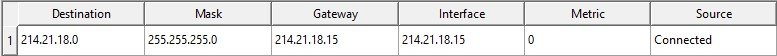

### UDP

UDP-сообщение с `comp0` на `comp2`:

- ARP-запрос в хаб. Хаб передает запрос остальным комьютерам. `comp1` игнорирует. `comp2` отправляет ARP-ответ, он летит на другие компьютеры, достигая `comp0`
- `comp0` отправляет UDP-сообщение
- Хаб передает UDP-сообщение другим компьютерам

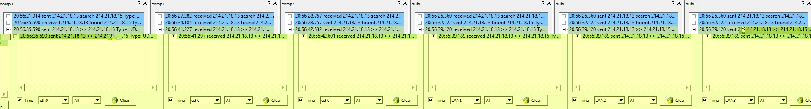

### TCP

TCP-сообщение с `comp0` на `comp2`:

- `comp0` отправляет `SYN`-сообщение в сторону `comp2` (с выставленным случайным числом `ISN=A`)
- `comp2` отправляет ответ `SYN-ACK` (с упомянутым числом `AckNumber=A` и `ISN=B`)
- `comp0` отправляет `ACK` (с `ISN=0`, `AckNumber=B`)
- `comp0` отправляет пакеты данных без флагов, с `ACK=0` и все возрастающим `ISN=` (начиная с `B`)
- Последним пакетом `comp0` отправляет пакет с флагом `FIN`, `ACK` и `ISN` идут по аналогии с предыдущими
- В ответ `comp2` отправдляет `FIN ACK`, где `ISN=0`, `ACK=n+1` (т.е. на 1 больше полученного)

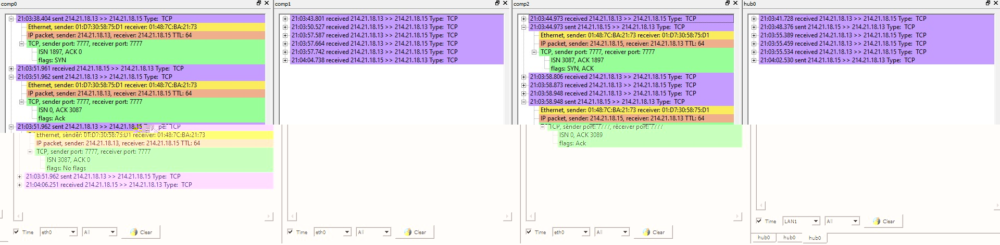

_Источник: https://intronetworks.cs.luc.edu/1/html/tcp.html_

## ЛОКАЛЬНАЯ СЕТЬ С КОММУТАТОРОМ (Сеть 2)

Три компьютера:

- `comp3`, `214.21.18.16`
- `comp4`, `214.21.18.17`
- `comp5`, `214.21.18.18`

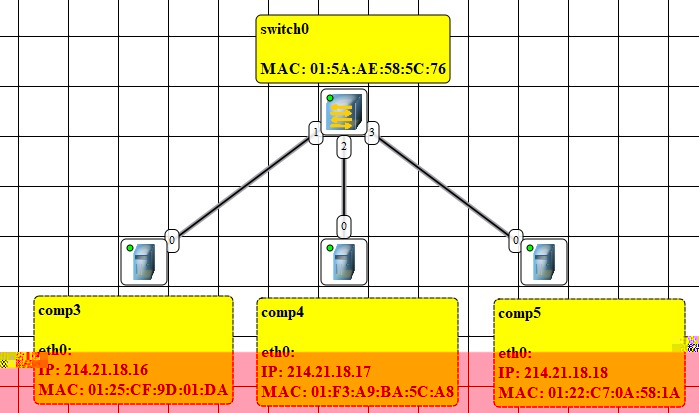

После ARP-приветствий от всех компьютеров:

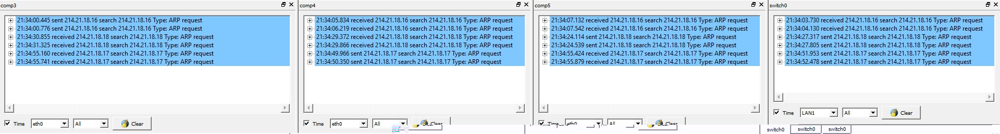

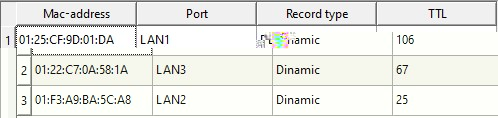

Идея свитча (коммутатора) заключается в том, что у него есть таблица коммутации. Изначально она пуста, в таком случае он работает как хаб (концентратор). В процессе передачи данных свитч обучается - при получении запроса с компьютера, в таблицу заносится информация о том, с какого порта пришел запрос и каков MAC-адрес отправителя - в будущем, запросы, адресованные этому компьютеру (по MAC-адресу), будут лететь конкретно ему. Когда таблица заполнится полностью, запросы будут лететь только до целевого получателя.

Про домены коллизий:

- [wikipedia](https://ru.wikipedia.org/wiki/%D0%94%D0%BE%D0%BC%D0%B5%D0%BD_%D0%BA%D0%BE%D0%BB%D0%BB%D0%B8%D0%B7%D0%B8%D0%B9)
- [reddit](https://www.reddit.com/r/ccna/comments/13i6i3y/collision_domains/)

В таблицах ситуация вполне очевидная: в Routing-таблице (1) только одна запись - сеть, в ARP (2) - 2 записи, другие компьютеры.

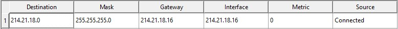

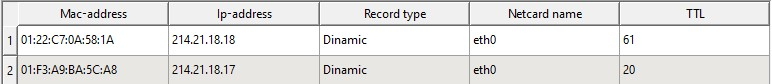

### UDP

На полностью обученном коммутаторе ситуация довольно простая:

`comp3` отправляет сообщения на коммутатор:

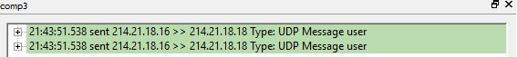

Коммутатор получает сообщения, заглядывает в таблицу:

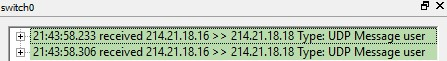

В таблице находит адресата, поэтому сообщение отправляется именно ему:

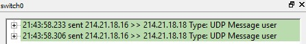

Адресат (`comp5`) получает сообщения:

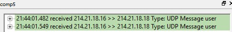

### TCP

Здесь ситуация также довольно прямолинейна - из-за того, что коммутатор обучен, общение выглядит так, будто компьютеры общаются напрямую. В остальном цепочка сообщений остается прежней:

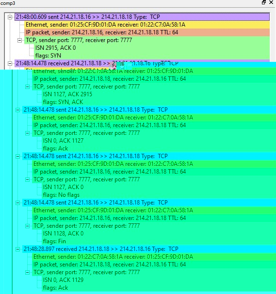

## МНОГОСЕГМЕНТНАЯ ЛОКАЛЬНАЯ СЕТЬ

Два компьютера:

- `comp6`, `214.21.18.19`
- `comp7`, `214.21.18.20`

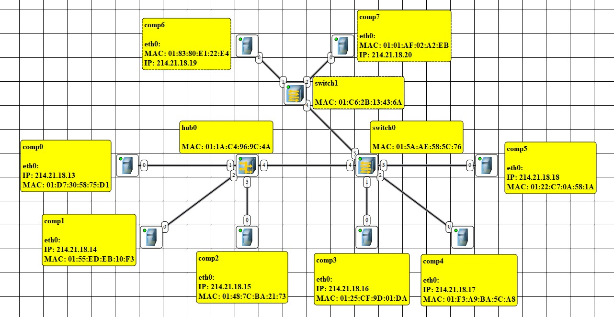

Я выбрал последовательное подключение. Кольцо отработало плохо - при broadcast ARP случилась коллизия - `hub0` и `switch0` попытатались одновременно обменяться данными.

Текущая конфигурация кажется мне вполне разумной и рабочей, так как связующим звеном выступает свитч, а не хаб - за счет чего после его обучения по сети будет гулять гораздо меньше запросов. Иначе говоря, на мой взгляд вполне разумно "давать" хабам как можно меньше компьютеров.

В ARP- и routing- таблицах нет никаких необычностей - в routing-таблице все также одна запись (т.к. все в одной сети), в ARP этих записей столько, сколько компьютеров "поздоровались".

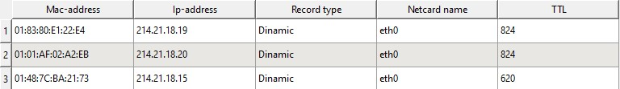

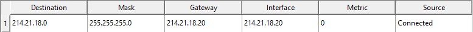

В switch0 ничего необычного:

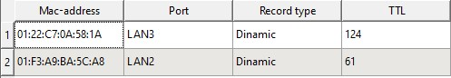

В switch1 для одного порта несколько записей - так как указанные MAC-адреса достижимы по этому порту:

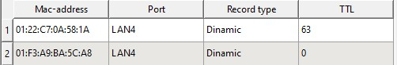

### UDP

Цепочка стала длиннее.

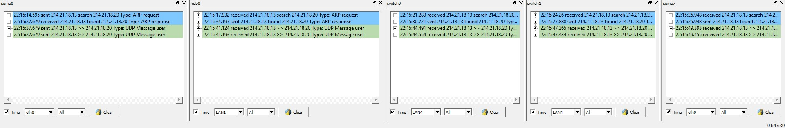

### TCP

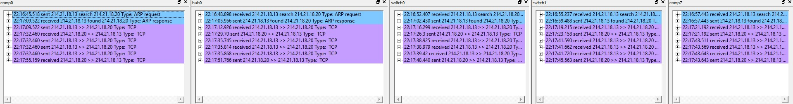

И в случае с TCP, и в случае с UDP, в обоих свитчах появились записи об отправителе (`comp0`) и об получателе (`comp7`):

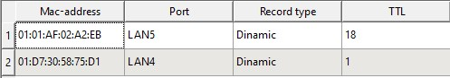

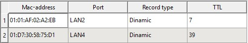

## Вывод

В этой лабораторной работе я построил модели локальной сети с концентратором, сети с коммутатором и многосегментной сети с 2 коммутаторами и 1 концентратором, проверил и протестировал полученную сеть посредством отправки TCP- и UDP- сообщений.
