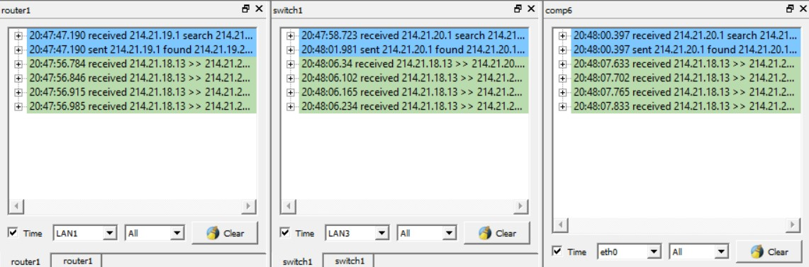
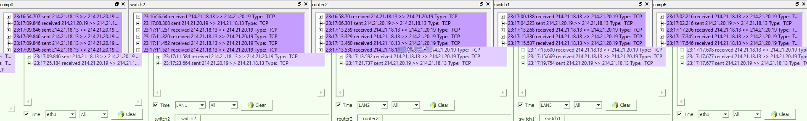
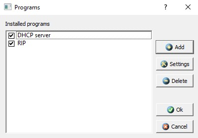

# Лабораторная работа №3

Студент: `Султанов Артур Радикович`, группа: `P3313`

## ЗАДАНИЕ 1. Сеть с одним маршрутизатором (вариант В1)

### Построение и настройка сети с маршрутизатором.

Таблица маршрутизации `router0`:

Помимо прочего, всем компьютерам нужно добавить в таблицу маршрутизации вхождения о других двух подсетях - при чем так, чтобы шлюзом был `router0`:

### Тестирование сети (отправка пакетов)

UDP (`comp0(214.21.18.13)` -> `comp6(214.21.20.19)`):

Здесь все довольно наглядно и просто. Путь UDP-сообщения:

`comp0[eth0]` -> `hub0[LAN1 -> LAN4]` -> `router0[LAN1 -> LAN3]` -> `switch1[LAN3 -> LAN1]` -> `comp6[eth0]`

Также важно отметить, что `comp0` искал ARP-запросом именно `router0`.

ARP-таблица `router0` после отправки сообщения:

---

TCP (`comp0(214.21.18.13)` -> `comp6(214.21.20.19)`):

С TCP все чуть сложнее (в силу прежде всего самого протокола), но по сути последовательность сообщений и маршрут тот же, что и с UDP.

## ЗАДАНИЕ 2. Сеть с двумя маршрутизаторами (вариант В2)

### Построение сети

Таблица маршрутизации `comp0` (для работы необходимо каждому компьютеру добавить вхождения о двух других подсетях - это можно сделать с помощью чуть более общей маски - тогда мы захватим все остальные подсети. А чтобы пакет в этой подсети все еще оставался в этой подсети, укажем у более общего правила метрику выше - чтобы ее приоритет был ниже):

Таблица маршрутизации `router0` (для работы необходимо также добавить строку о третьей подсети - для `router0` это 3, для `router1` - 1):

### Тестирование сети (отправка пакетов)

UDP:

TCP:

## ЗАДАНИЕ 3. Сеть с тремя маршрутизаторами (вариант B3)

Таблица маршрутизации `comp0`:

Таблица маршрутизации `router0`:

### Тестирование сети (отправка пакетов)

Отправка UDP прошла неудачно: пакеты продублировались, так как после хаба пошли двумя путями к одному компьютеру:

Исправим сеть, заменив `hub0` на `switch2`:

И действительно, UDP-сообщение успешно дошло без повторений:

TCP тоже прошло успешно, без коллизий:

### Настройка динамической маршрутизации по протоколу RIP

Установим на всех компьютерах и роутерах RIP:

И увидим периодические RIP-сообщения (роутеры оповещают других о том, что они знают, как добраться до какой-либо подсети): 

И, соответственно, все участники сети получают эту информацию:

`router1`:

`comp4`:

Далее, смоделируем выход из строя одного из коммутаторов (удалив его), получаем:

`router1`:

`comp4`:

Как видно, из-за того, что RIP-рассылка со стороны подсети `214.21.18.0` прекратилась, у всех участников сети "пропала" информация об этой подсети.

## Настройка автоматического получения сетевых настроек по протоколу DHCP

Добавим DHCP-сервер на все роутеры:

Не забыв настроить диапазон адресов:

Логи:

После получения всеми компьютерами сетевых настроеек имеем (`comp0`):

Отправим UDP-сообщение с `comp0` на `comp6`:

И действительно, UDP-сообщение успешно прошло от `comp0` (`214.21.18.5`) до `comp6` (`214.21.20.4`).

## Вывод

В рамках даной лабораторной работы были построены модели сети на основе трех подсетей из предыдущей лабораторной работы.

На практике познакомился с RIP и DHCP, настроил сети, использующие эти протоколы, провел тестирование всех полученных сетей посредством отправки TCP- и UDP-сообщений.
