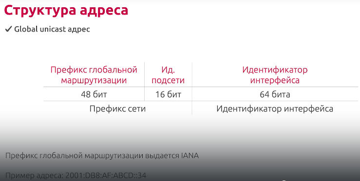
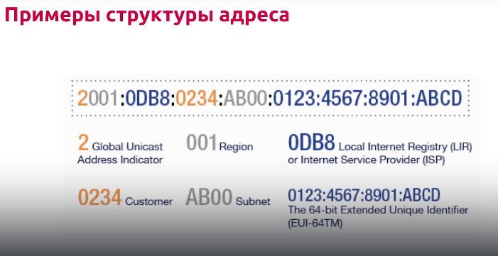
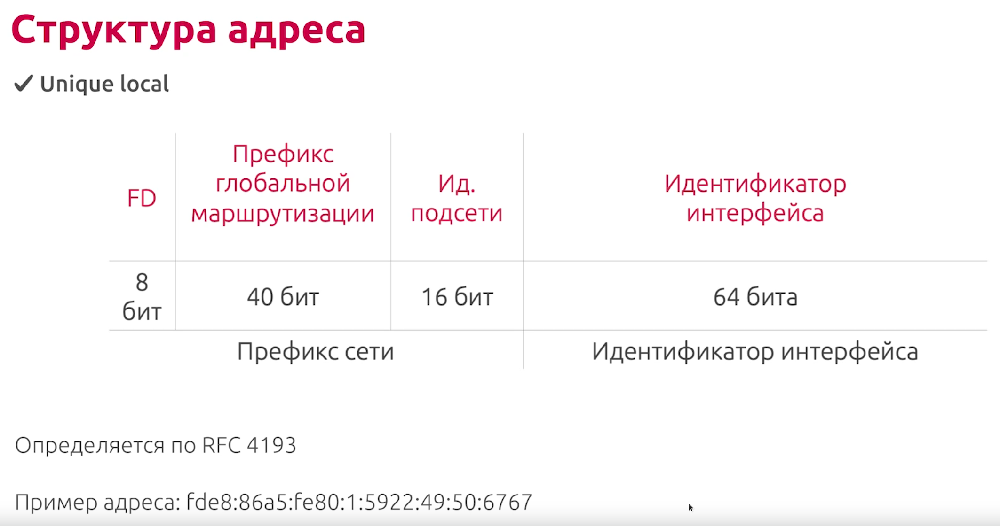

# IP

## IPv4

`W.X.Y.Z` - 32 бита. 4 октета (8-битные поля).

Две части:

- Адрес сети (первая часть)
- Адрес узла (вторая часть)

### Классы

| Класс | Диапазон 1 октета | Биты 1 октета | Сетевая/Узловая части адреса | Маска подсети | Число возможных сетей/узлов |
|-------|-------------------|---------------|------------------------------|---------------|-----------------------------|
| `A` | 1-127 | `00000000-01111111` | `С.У.У.У` | `255.0.0.0` | 126 сетей ($2^7-2$), 16777214 узлов для каждой сети ($2^{24}-2$) |
| `B` | 128-191 | `10000000-10111111` | `С.С.У.У` | `255.255.0.0` | 16382 сетей ($2^{14}-2$), 65534 узлов для каждой сети ($2^{16}-2$) |
| `C` | 192-223 | `11000000-11011111` | `С.С.С.У` | `255.255.255.0` | 2097150 сетей ($2^{21}-2$), 254 узла для каждой сети ($2^8-2$) |
| `D` | 224-239 | `11100000-11101111` | Не для коммерческого использования | | |
| `D` | 240-255 | `11110000-11111111` | Не для коммерческого использования | | |

### Деление с помощью маски

`192.168.0.1/24`

24 - кол-во единичных бит в маске.

| Имя | Значение | Бинарное значение |
|-----|----------|-------------------|
| Адрес | `192.168.0.1` | `11000000.10101000.00000000 \| 00000001` |
| Bitmask | `24` | |
| Netmask | `255.255.255.0` | `11111111.11111111.11111111 \| 00000000` |
| Network | `192.168.0.0` | `11000000.10101000.00000000 \| 00000000` |
| Broadcast | `192.168.0.255` | `11000000.10101000.00000000 \| 11111111` |
| Hostmin | `192.168.0.1` | `11000000.10101000.00000000 \| 00000001` |
| Hostmax | `192.168.0.254` | `11000000.10101000.00000000 \| 11111110` |
| Hosts | 254 | |

### Зарезервированные адреса

| Класс адреса | Число зарезервированных сетевых адресов | Сетевые адреса |
|--------------|-----------------------------------------|----------------|
| `A` | 1 | `10.0.0.0` |
| `B` | 16 | `172.16.0.0` - `172.31.0.0` |
| `C` | 256 | `192.168.0.0` - `192.168.255.0` |

### Специальные IP-адреса

- `127.0.0.0/8` (loopback)
- Адрес сети (номер узла заполнен битовыми нулями)
- Адрес широковещания (номер узла заполнен битовыми единицами)

## IPv6

`x:x:x:x:x:x:x:x` - 128 бит. 8 элементов по 16 бит.

Пример:

- `2001:0DB8:00AF:ABCD:0000:0000:0000:0034`
- `2001:DB8:AF:ABCD::34` (короткая запись адреса выше - убраны ведущие нули, несколько подряд идущих `0000` заменены на `::`)

### Типы адресов

- `Unicast` - идентифицируют только один сетевой интерфейс
- `Anycast` - идентифицируют группу интерфейсов. Пакет, отправленный на такой адрес, доставляется только на один интерфейс из этой группы, как правило - наиболее близкий к отправителю.
- `Multicast` - идентифицирует группу интерфейсов. В отличии от `Anycast`, пакет будет разослан всем узлам в группе.

Broadcast-а нет.

### Логические части адреса IPv6

Обычно 64 бита для префикса, 64 бита для идентификатора интерфейса. Идея схожа с масками.

Пример: `2001:DB8:AF:ABCD:::34/64`

### Виды адресов

- `Global Unicast`a: Аналог белого адреса IPv4. Могут быть настроены статически или динамически. Начинается с `2` или `3`. Первая часть - от `2000` до `3FFF`. Отдельно выделяется сеть `2001:0DB8::/32`
- `Link-local`: Позволяет устройству обмениваться данными с другими устройствами под управлением `IPv6` по одному и тому же каналу и только по данному каналу (подсети). Не маршрутизируются (маршрутизаторы не должны отправлять пакеты с адресами `link-local` в другие сети) Локальные IPv6-адреса канала находятся в диапазоне `FE80::/10`
- `Loopback`: Используется для отправки пакета самому себе и не может быть назначен физ.интерфейсу. `::1/128` или просто `::1` (aka `0000:0000:0000:0000:0000:0000:0000:0001`)
- `Unspecified`: Неопределенный адрес, состоит из нулей, `::/128`. `::`. Не может быть назначен интерфейсу и используется только в качестве адреса источника в IPv6-пакете. Неопределенный адрес используется в качестве адреса источника когда устройству еще не назначен постоянный IPv6-адрес
- `Unique Local`: Идея похожа на серые IPv4-адреса, но есть отличия. Диапазон - от `FC00::/7` до `FDFF::/7`
- `IPv4 Embedded`: Для более удобного перехода с IPv4 на IPv6
- `Multicast`: Для рассылок внутри группы. Начинаются с `FF`

### Структура адреса

#### Global Unicast адрес

#### Unique Local

### Особые адреса

- `:/128` - текущий хост
- `:/0` - маршрут по умолчанию
- `::1/128` - обратная петля
- `ff02::1` - все узлы в канале связи ("локальная сеть" с оговорками)
- `ff02::2` - все маршрутизаторы в канале связи
