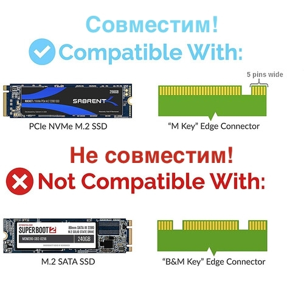
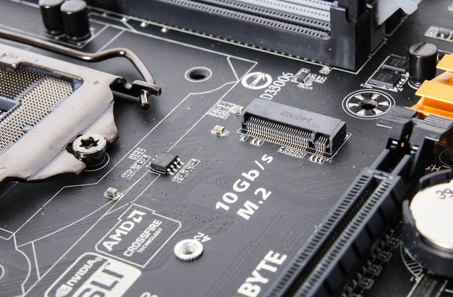

# NVMe

Султанов Артур, P3313 (367553)

---

## Описание

**NVM Express (NVMe, NVMHCI)** — от англ. Non-Volatile Memory Host Controller Interface Specification — _интерфейс_ доступа к _твердотельным накопителям_, подключённым по шине PCI Express.

[wikipedia](https://ru.wikipedia.org/wiki/NVM_Express)

<!-- «NVM» в названии спецификации обозначает энергонезависимую память -->

---

## История

Первые подробности появились на Intel Developer Forum (2007) - как нового интерфейса коммуникации хоста и контроллера NAND. Первая спецификация NVMHCI 1.0 была закончена в апреле 2008 года и размещена на сайте Intel.

Техническая проработка длилась до 2011 группой **NVM Express Workgroup** (порядка 90 компаний). Первая спецификация NVMe вышла 1 марта 2011 года.

<!-- NAND - это конструкция флэш-памяти -->

---

## История

Последующие версии:

- NVMe 1.0e - январь 2013
- NVMe 1.1b - июль 2014 года
- NVMe 1.2 - ноябрь 2014 года
- NVMe 1.3 - май 2017 года
- NVMe 2.0 - май 2021 года

<!-- https://ru.wikipedia.org/wiki/NVM_Express#%D0%98%D1%81%D1%82%D0%BE%D1%80%D0%B8%D1%8F -->

---

### Распиновка

|  |  |
|--|--|
|  |  |

---

### Внешний вид

|  |  |
|--|--|
|  |  |

---

## Характеристики

- Теоретическая скорость передачи данных - до 20Гбит/c (в реальности до 7500 Мбайт/с)
- Работа на физическом и канальном уровнях.
- Подключение - через PCI Express, иначе говоря "по проводу".
- Топология: ведущий (хост) - ведомый (накопитель). Ведомых может быть несколько.

<!-- https://www.ibm.com/think/topics/nvme-vs-m2 -->

---

## Характеристики

- Асинхронный
- Дуплексный
- Роль ведущего (компьютер, сервер) и ведомого (накопитель). Ведомых может быть несколько.
- Работает на PCIe, использует 4 (x4) линии для передачи данных (обычно). Также есть поддержка работы на 1 и 2 PCIe-линиях.

<!-- https://nvmexpress.org/education/faqs/ -->

<!-- https://americas.kioxia.com/content/dam/kioxia/en-us/business/ssd/life-after-sata/asset/KIOXIA_A_New_Category_of_SSD_FAQ.pdf -->

<!-- https://www.reddit.com/r/unRAID/comments/11win00/can_someone_explain_nvme_to_me_the_4x_pcie_lanes/ -->

<!-- https://superuser.com/questions/1683837/pcie-lanes-for-nvme-memory -->

---

## Особенности / преимущества

- Высокая пропускная способность (как теоретическая, так и реализованная)
- До 65535 "очередей", в каждой до 65535 команд (в сравнении, у AHCI 1 очередь до 32 команд)
- Подключение с помощью PCI дает простор для макс.скорости (пусть и на текущий момент теоретической)
- Наличие режима ожидания (standby) для экономии электроэнергии
- Поддержка всех популярных ОС, широкая поддержка Linux (CLI, библиотеки...)
- Компактный набор команд

<!-- https://www.kingston.com/en/blog/pc-performance/top-reasons-upgrade-nvme-ssd -->
<!-- https://www.purestorage.com/knowledge/what-is-nvme.html -->

---

## Особенности / преимущества

---

## 192 страницы описания доп. возможностей

---

## Сферы использования: ПК, игры

---

## Сферы использования: Облачные платформы

| AWS S3 | MWS | Google Cloud | ... |
|--------|-----|--------------|-----|
|  |  |  | |
