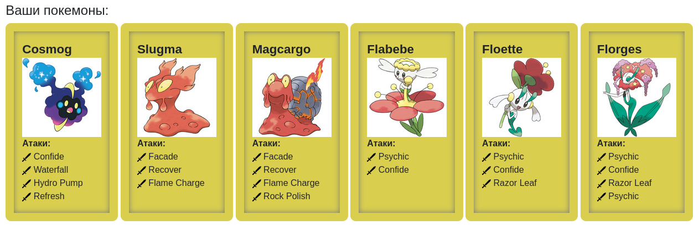

# Лабораторная работа #2

Вариант №1344653

### Задание

1. Ознакомиться с документацией, обращая особое внимание на классы Pokemon и Move. При дальнейшем выполнении лабораторной работы читать документацию еще несколько раз.
2. Скачать файл Pokemon.jar. Его необходимо будет использовать как для компиляции, так и для запуска программы. Распаковывать его не надо! Нужно научиться подключать внешние jar-файлы к своей программе.
3. Написать минимально работающую программу и посмотреть как она работает.

```java
    Battle b = new Battle();
    Pokemon p1 = new Pokemon("Чужой", 1);
    Pokemon p2 = new Pokemon("Хищник", 1);
    b.addAlly(p1);
    b.addFoe(p2);
    b.go();
```

4. Создать один из классов покемонов для своего варианта. Класс должен наследоваться от базового класса Pokemon. В конструкторе нужно будет задать типы покемона и его базовые характеристики. После этого попробуйте добавить покемона в сражение.
5. Создать один из классов атак для своего варианта (лучше всего начать с физической или специальной атаки). Класс должен наследоваться от класса PhysicalMove или SpecialMove. В конструкторе нужно будет задать тип атаки, ее силу и точность. После этого добавить атаку покемону и проверить ее действие в сражении. Не забудьте переопределить метод describe, чтобы выводилось нужное сообщение.
6. Если действие атаки отличается от стандартного, например, покемон не промахивается, либо атакующий покемон также получает повреждение, то в классе атаки нужно дополнительно переопределить соответствующие методы (см. документацию). При реализации атак, которые меняют статус покемона (наследники StatusMove), скорее всего придется разобраться с классом Effect. Он позволяет на один или несколько ходов изменить состояние покемона или модификатор его базовых характеристик.
7. Доделать все необходимые атаки и всех покемонов, распределить покемонов по командам, запустить сражение.

## Описание покемонов



### `Cosmog`

**Type**: Psychic<br/>
**HP**: 43<br/>
**Attack**: 29<br/>
**Defense**: 31<br/>
**Sp. Atk**: 29<br/>
**Sp. Def**: 31<br/>
**Speed**: 37<br/>
**Moves**:
- Confide
- Waterfall
- Hydro Pump
- Refresh

### `Slugma`

**Type**: Fire<br/>
**HP**: 40<br/>
**Attack**: 40<br/>
**Defense**: 40<br/>
**Sp. Atk**: 70<br/>
**Sp. Def**: 40<br/>
**Speed**: 20<br/>
**Moves**:
- Facade
- Recover
- Flame Charge

### `Magcargo` (Evolution of Slugma)

**Type**: Fire, Rock<br/>
**HP**: 60<br/>
**Attack**: 50<br/>
**Defense**: 120<br/>
**Sp. Atk**: 90<br/>
**Sp. Def**: 80<br/>
**Speed**: 30<br/>
**Moves**:
- Facade
- Recover
- Flame Charge
- Rock Polish

### `Flabebe`

**Type**: Fairy<br/>
**HP**: 44<br/>
**Attack**: 38<br/>
**Defense**: 39<br/>
**Sp. Atk**: 61<br/>
**Sp. Def**: 79<br/>
**Speed**: 42<br/>
**Moves**:
- Psychic 
- Confide

### `Floette` (Evolution of Flabebe)

**Type**: Fairy<br/>
**HP**: 54<br/>
**Attack**: 45<br/>
**Defense**: 47<br/>
**Sp. Atk**: 75<br/>
**Sp. Def**: 98<br/>
**Speed**: 52<br/>
**Moves**:
- Psychic 
- Confide
- Razor Leaf

### `Florges` (Evolution of Floette)

**Type**: Fairy<br/>
**HP**: 78<br/>
**Attack**: 65<br/>
**Defense**: 68<br/>
**Sp. Atk**: 112<br/>
**Sp. Def**: 154<br/>
**Speed**: 75<br/>
**Moves**:
- Psychic 
- Confide
- Razor Leaf
- Psychic

## Описание атак

### `Confide`

**Type**: Normal<br/>
**Category**: Status<br/>
**Power**: -<br/>
**Accuracy**: -<br/>
**Effects**:<br/>
Confide lowers the target's Special Attack by one stage. Stats can be lowered to a minimum of -6 stages each.

### `Facade`

**Type**: Normal<br/>
**Category**: Physical<br/>
**Power**: 70<br/>
**Accuracy**: 100<br/>
**Effects**:<br/>
Facade deals damage, and hits with double power (140) if the user is burned, poisoned or paralyzed. In the case of a burn, the usual attack-halving still occurs so Facade hits with an effective power of 70.

### `Flame Charge`

**Type**: Fire<br/>
**Category**: Physical<br/>
**Power**: 50<br/>
**Accuracy**: 100<br/>
**Effects**:<br/>
Flame Charge deals damage and raises the user's Speed by one stage. Stats can be raised to a maximum of +6 stages each.

### `Hydro Pump`

**Type**: Water<br/>
**Category**: Special<br/>
**Power**: 110<br/>
**Accuracy**: 80<br/>
**Effects**:<br/>
Hydro Pump deals damage with no additional effect.

### `Psychic`

**Type**: Psychic<br/>
**Category**: Special<br/>
**Power**: 90<br/>
**Accuracy**: 100<br/>
**Effects**:<br/>
Psychic deals damage and has a 10% chance of lowering the target's Special Defense by one stage. Stats can be lowered to a minimum of -6 stages each.

### `Razor Leaf`

**Type**: Grass<br/>
**Category**: Physical<br/>
**Power**: 55<br/>
**Accuracy**: 95<br/>
**Effects**:<br/>
Razor Leaf deals damage and has an increased critical hit ratio (1⁄8 instead of 1⁄24).

### `Recover`

**Type**: Normal<br/>
**Category**: Status<br/>
**Power**: -<br/>
**Accuracy**: -<br/>
**Effects**:<br/>
Recover restores up to 50% of the user's maximum HP.

### `Refresh`

**Type**: Normal<br/>
**Category**: Status<br/>
**Power**: -<br/>
**Accuracy**: -<br/>
**Effects**:<br/>
Cures paralysis, poison, and burns.

### `Rock Polish`

**Type**: Rock<br/>
**Category**: Status<br/>
**Power**: -<br/>
**Accuracy**: -<br/>
**Effects**:<br/>
Rock Polish raises the user's Speed by two stages. Stats can be raised to a maximum of +6 stages each.

### `Waterfall`

**Type**: Water<br/>
**Category**: Physical<br/>
**Power**: 80<br/>
**Accuracy**: 100<br/>
**Effects**:<br/>
Waterfall deals damage and has a 20% chance of causing the target to flinch (if the target has not yet moved). Pokémon with the ability Inner Focus or those behind a Substitute cannot be made to flinch.

### Исходный код

https://github.com/sultanowskii/itmo-edu/blob/master/programming/lab2/

### Вывод программы

```
Cosmog Peter from the team Greren enters the battle!
Flabebe Dean from the team Blue enters the battle!
Flabebe Dean struggles. 
Cosmog Peter loses 6 hit points.
Flabebe Dean loses 2 hit points.

Cosmog Peter uses Hydro Pump. 
Flabebe Dean loses 5 hit points.

Flabebe Dean struggles. 
Cosmog Peter loses 3 hit points.
Flabebe Dean loses 1 hit points.

Cosmog Peter uses Hydro Pump. 
Flabebe Dean loses 5 hit points.
Flabebe Dean faints.
Floette Charlie from the team Blue enters the battle!
Floette Charlie struggles. 
Cosmog Peter loses 4 hit points.
Floette Charlie loses 1 hit points.
Cosmog Peter faints.
Slugma Stephen from the team Greren enters the battle!
Floette Charlie uses Psychic. 
Slugma Stephen loses 6 hit points.

Slugma Stephen struggles. 
Floette Charlie loses 3 hit points.
Slugma Stephen loses 1 hit points.

Floette Charlie uses Confide. 
Slugma Stephen decreases special attack.

Slugma Stephen uses Recover. 
Slugma Stephen restores 2 hit points.

Floette Charlie uses Psychic. 
Slugma Stephen loses 5 hit points.

Slugma Stephen uses Facade. 
Floette Charlie loses 4 hit points.

Floette Charlie uses Confide. 
Slugma Stephen decreases special attack.

Slugma Stephen uses Facade. 
Floette Charlie loses 3 hit points.

Floette Charlie uses Razor Leaf. 
Slugma Stephen loses 2 hit points.
Slugma Stephen faints.
Magcargo Alex from the team Greren enters the battle!
Floette Charlie uses Razor Leaf. 
Magcargo Alex loses 5 hit points.

Magcargo Alex uses Facade. 
Floette Charlie loses 6 hit points.
Floette Charlie faints.
Florges Mike from the team Blue enters the battle!
Florges Mike uses Psychic. 
Magcargo Alex loses 4 hit points.

Magcargo Alex uses Rock Polish. 
Magcargo Alex increases speed.

Florges Mike uses Razor Leaf. 
Magcargo Alex loses 5 hit points.
Magcargo Alex faints.
Team Greren loses its last Pokemon.
The team Blue wins the battle!
```

### Вывод

В рамках выполнения данной лабораторной работы я познакомился с базовыми принципами и концепциями ООП, модификаторами доступа в Java, а также назначением `final` и `static`. Помимо этого, удалось упростить сборку проекта с помощью bash-скрипта.
