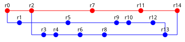

# Лаба 2

### Вариант

**Номер**: 12432456

### Задание

Сконфигурировать в своём домашнем каталоге репозитории svn и git и загрузить в них начальную ревизию файлов с исходными кодами (в соответствии с выданным вариантом).

Воспроизвести последовательность команд для систем контроля версий svn и git, осуществляющих операции над исходным кодом, приведённые на блок-схеме.

При составлении последовательности команд необходимо учитывать следующие условия:
- Цвет элементов схемы указывает на пользователя, совершившего действие (красный - первый, синий - второй).
- Цифры над узлами - номер ревизии. Ревизии создаются последовательно.
- Необходимо разрешать конфликты между версиями, если они возникают.

### Отчёт по работе должен содержать:

- Задание и блок-схему в соответствии с вариантом.
- Список команд, использованных при создании и конфигурации репозиториев в домашнем каталоге пользователя.
- Номера ревизий и соответствующие им последовательности команд с комментариями (для svn и git).
- Выводы по работе.

# Pro tip

Точки на сайте (коммиты) - кликабельны. Каждая из них при нажатии отдает zip-архив с файлами для конкретного коммита (см. [commits/](commits/)).

Соц.опрос показал, что самостоятельно до этого 300iq мува додумываются 0% людей.
