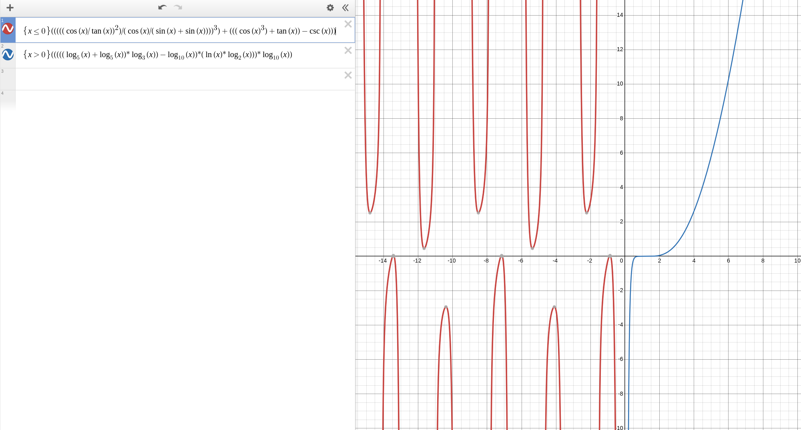

# Лабораторная работа #2

Вариант: `2311`

Провести интеграционное тестирование программы, осуществляющей вычисление системы функций (в соответствии с вариантом).

$x <= 0 : (((((cos(x) / tan(x)) ^ 2) / (cos(x) / (sin(x) + sin(x)))) ^ 3) + (((cos(x) ^ 3) + tan(x)) - csc(x)))$

$x > 0 : (((((log_{5}(x) + log_{5}(x)) * log_{3}(x)) - log_{10}(x)) * (ln(x) * log_{2}(x))) * log_{10}(x))$

Правила выполнения работы:

1. Все составляющие систему функции (как тригонометрические, так и логарифмические) должны быть выражены через базовые (тригонометрическая зависит от варианта; логарифмическая - натуральный логарифм).
2. Структура приложения, тестируемого в рамках лабораторной работы, должна выглядеть следующим образом (пример приведён для базовой тригонометрической функции sin(x)):

    

3. Обе "базовые" функции (в примере выше - sin(x) и ln(x)) должны быть реализованы при помощи разложения в ряд с задаваемой погрешностью. Использовать тригонометрические / логарифмические преобразования для упрощения функций ЗАПРЕЩЕНО.
4. Для КАЖДОГО модуля должны быть реализованы табличные заглушки. При этом, необходимо найти область допустимых значений функций, и, при необходимости, определить взаимозависимые точки в модулях.
5. Разработанное приложение должно позволять выводить значения, выдаваемое любым модулем системы, в сsv файл вида «X, Результаты модуля (X)», позволяющее произвольно менять шаг наращивания Х. Разделитель в файле csv можно использовать произвольный.
