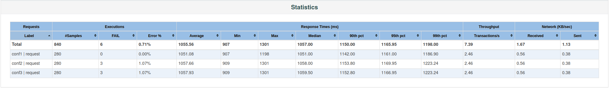
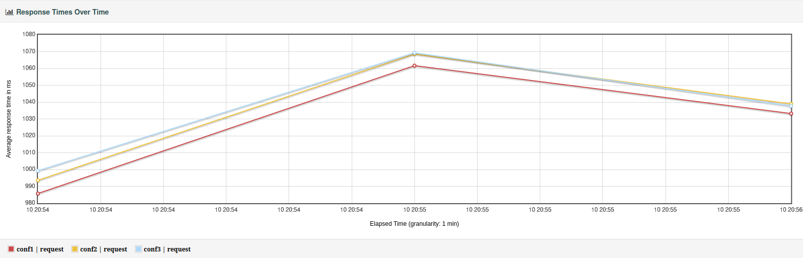

# Лабораторная работа №4

Сперва пробросим удаленный хост к себе на локалку с помощью команды:

```bash
# -N: Do not execute a remote command.
# -L: Forwarding
ssh -N -L 9999:stload.se.ifmo.ru:8080 sXXXXXX@se.ifmo.ru -p 2222
```

И действительно, работает:

```bash
❯ curl localhost:9999
<html><head><title>Error</title></head><body>Unauthorized. Check GET parameters: token, user</body></html>%  
```

Тогда для тестирования имеем:

- URL первой конфигурации (`$ 2600`) - http://localhost:9999?token=495356178&user=-2104219887&config=1
- URL второй конфигурации (`$ 2700`) - http://localhost:9999?token=495356178&user=-2104219887&config=2
- URL третьей конфигурации (`$ 5200`) - http://localhost:9999?token=495356178&user=-2104219887&config=3

Посмотрим на каждый из них:

```bash
❯ curl http://localhost:9999\?token\=495356178\&user\=-2104219887\&config\=1
              load:   0.10 r/s
     response time:    900 ms
 max response time:    820 ms
❯ curl http://localhost:9999\?token\=495356178\&user\=-2104219887\&config\=2
              load:   0.20 r/s
     response time:    701 ms
 max response time:    820 ms
❯ curl http://localhost:9999\?token\=495356178\&user\=-2104219887\&config\=3
              load:   0.20 r/s
     response time:    301 ms
 max response time:    820 ms
```

Ничего примечательного, в ответ они отдают информацию о своей производительности.

## Нагрузочное тестирование


По итогам нагрузочного тестирования, с небольшим отрывом по всем показателям (90, 95, 99 перцентилям, среднему и медианному времени ответа), победила первая конфигурация - вдобавок ко всему, она является самой дешевой (2600$) и ни разу не вышла за пороговое значение времени ответа (1200мс), в отличии от конкурентов.





## Стресс-тестирование


Как видно на графике, у системы начинаются проблемы при переходе порога 30-35 запросов/сек. (допущены погрешности из-за малого кол-ва времени, когда был лишь 1 запрос/сек). После перехода этого порога среднее время ответа значительно увеличивается, а также начинают возникать 503 ошибки.


## Вывод

По итогам нагрузочного и стресс тестирования, было определено, что конфигурация 1 выигрывает по большинству показателей: у нее наименьшее среднее и медианное время ответа, она не превысила пороговое значение макс.допустимого времени ответа, а также обладает наименьшей ценой. Пороговой нагрузкой является 30-35 запросов/сек. При росте нагрузки система с конфигурацией 1 начинает отдавать запросы с куда более большим средним и медианным временем ответа, макс.время ответа значительно возрастает с ростом запросов/сек, а также начинают возникать ошибки 503 Service Unavailable.
